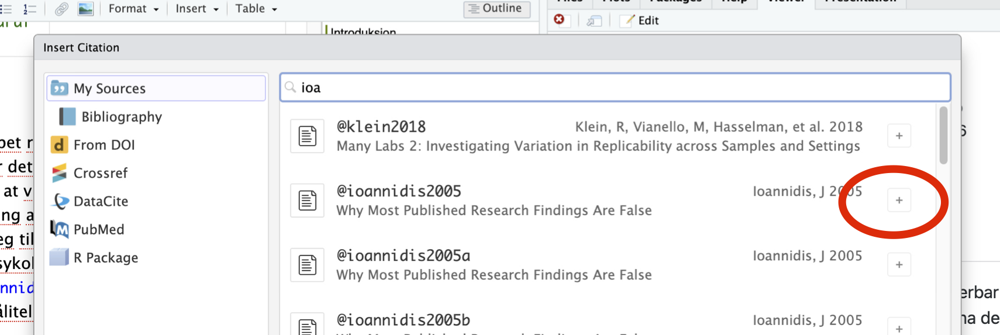

- Det ble langt til slutt ;-) Fint paper. Har rettet litt skrivefeil og fikset litt på referansene. Se spesielt på hvorand in-text og en-of-sentence citeringer er brukt. Ta en titt på pdf-versjonen. Ser ganske bra ut eller?
- I tekst benytter en sitering uten parenteser. Se f.eks McNutt i starten av Introduksjon
- Når vi trenger flere siteringer på slutten av en setning skiller vi den med semikolon inne i klammene f.eks `[@ioannidis2005; @simmons2011]`. Inne i siteringsverktøyet gjør en dette ved å klikke det lille pluss-tegnet til høyre.

- Jeg har skiftet til norske anførselstegn
- Enkelte lange setninger har jeg splittet vha. punktum.

